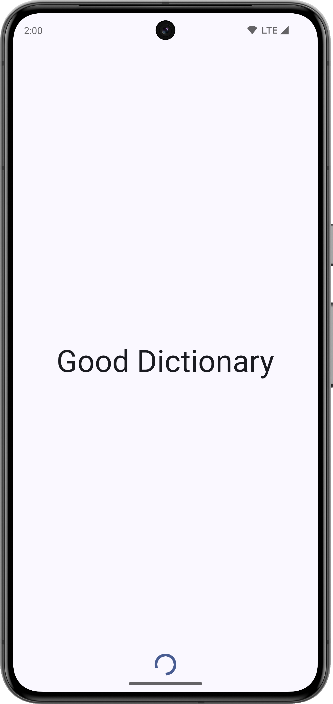
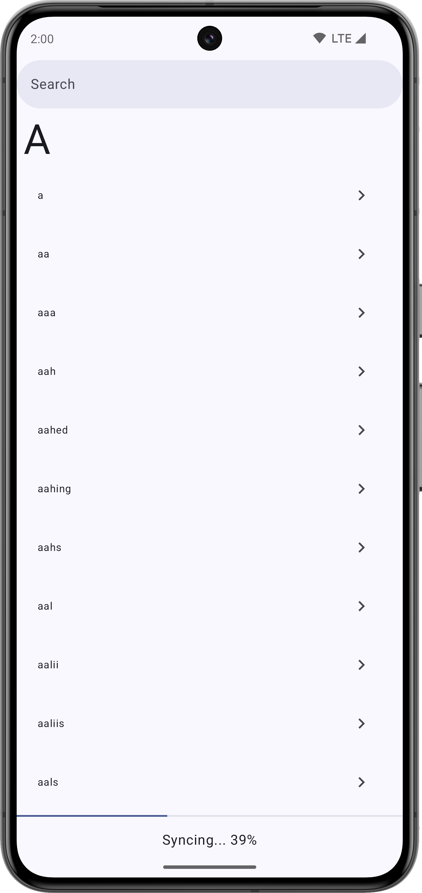
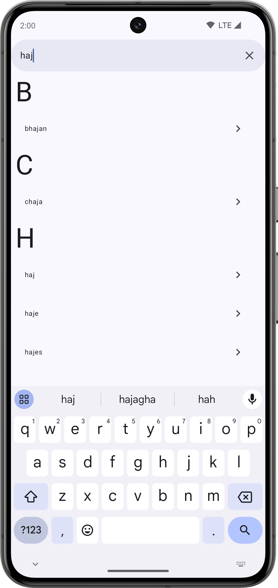
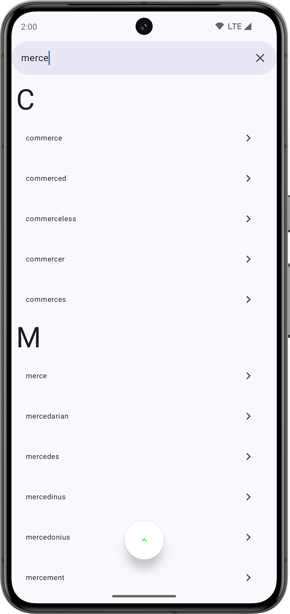
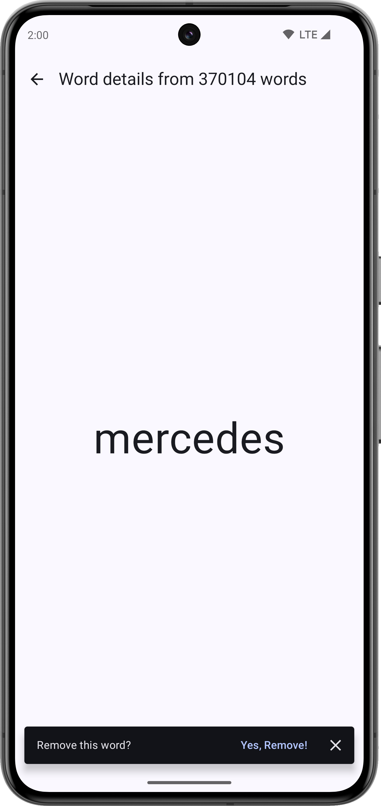
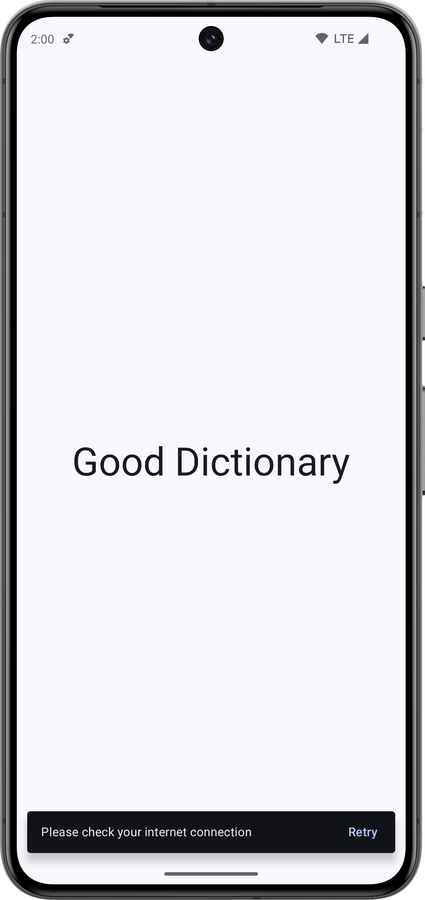

# Good Dictionary

## Screenshots

  
   
  
  
  
  

## Introduction
Welcome to Good Dictionary, a cutting-edge, efficient dictionary app crafted with Kotlin, showcasing the best of Android development technologies. Our mission is to deliver a seamless and enriching dictionary experience, powered by Kotlin Coroutines, MVVM architecture, Kotlin Flows, among others.

## Project Structure
Good Dictionary is structured into several modules, designed for scalability, maintainability, and modular development. Here's an overview of our module architecture:

- **App Module (`app`)**: The main entry point of the application, integrating all other modules and handling the app lifecycle.
- **UI Modules**: 
  - **Words List (`:ui:words-list`)**: Manages the presentation and interaction logic for listing dictionary words.
  - **Word Details (`:ui:word-details`)**: Handles the display of detailed information for a specific word.
  - **Splash Screen (`:ui:splash`)**: Presents the initial splash screen to users upon app launch.
- **Feature Module**:
  - **Dictionary Sync (`:feature:dictionary-sync`)**: Manages synchronization of dictionary data with remote sources or local updates.
- **Data Module (`data`)**: Responsible for data management, including storage, retrieval, and manipulation. It depends on the Domain module for data definitions.
- **Domain Module (`domain`)**: Contains the business logic and use cases of the application. It is a dependency for all UI modules and the Data module.

Each UI module depends on the Domain module to ensure separation of concerns and modularity. The Data module also depends on the Domain module for defining data structures and business rules.

## Current State and Next Steps
Given the limited time allocated for this take-home task, the project showcases a solid foundation and a glimpse into its potential. However, to fully realize this potential, the following steps are necessary:

- **Increase Code Coverage**: Currently, only a limited number of tests have been written. Expanding test coverage is crucial for ensuring reliability and maintainability.
- **Architecture Refinement**: Transitioning to a Unidirectional Data Flow (UDF) architecture from the current ViewModel usage could enhance the project's scalability and readability.
- **Screenshot Testing**: Implementing screenshot testing to ensure UI consistency across devices and versions.
- **Continuous Integration (CI) Pipeline**: Establishing a CI pipeline would automate testing and build processes, ensuring that every change is verified for quality and functionality.

## Features
- Fast and responsive dictionary search functionality.
- Modern, intuitive UI with Jetpack Compose.
- Asynchronous data handling with Kotlin Coroutines and Flows.
- MVVM architecture for scalable development.
- Dependency Injection with Dagger Hilt for a clean, manageable codebase.
- Modular architecture for focused development and faster build times.
- State-of-the-art navigation and design with Compose Navigation and Material3.
- Performance optimizations with Microbenchmarking, KSP, and Compose Metrics.

## Getting Started

### Prerequisites
- Android Studio Jellyfish | 2023.3.1 Canary 12 or later
- JDK 17 or later

### Building the Project
1. Clone this repository.
2. Open the project in Android Studio.
3. Sync the project with Gradle files.
4. Build the project by selecting `Build > Make Project`.
5. To run the application, select `Run > Run 'app'`.

## Technologies Used
- Kotlin Coroutines & Flows
- Jetpack Compose
- MVVM Architecture
- Jetpack Worker
- Dagger Hilt
- Gradle Convention Plugins
- Spotless
- Compose Linter
- Multi-Module Architecture
- Compose Navigation
- Material3
- Microbenchmarking
- KSP (Kotlin Symbol Processing)
- Compose Metrics

